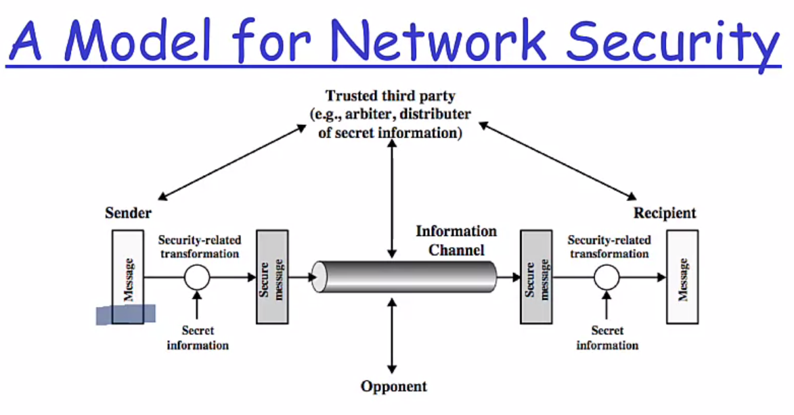
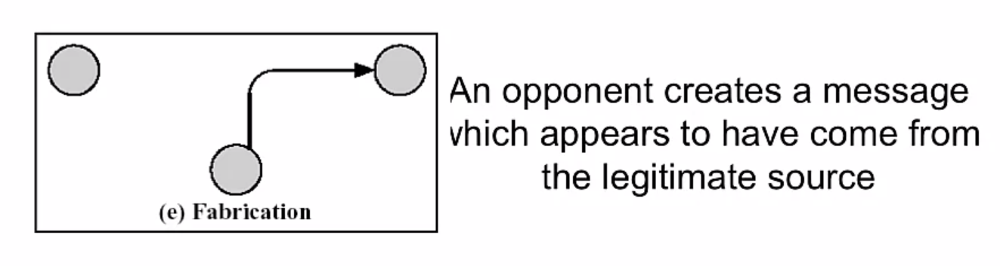
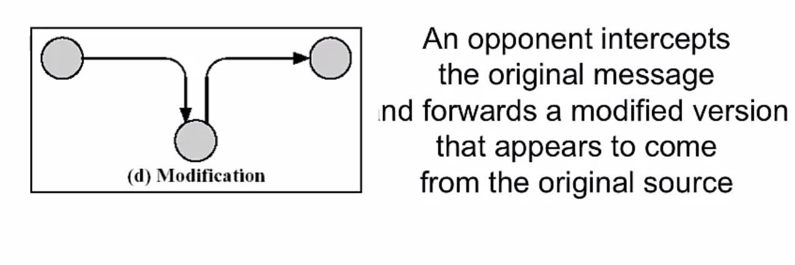
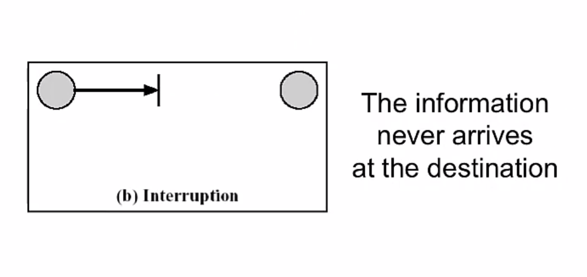
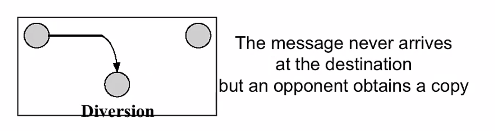

<!-- START doctoc generated TOC please keep comment here to allow auto update -->
<!-- DON'T EDIT THIS SECTION, INSTEAD RE-RUN doctoc TO UPDATE -->
**Table of Contents**

- [Types of actors and their motives](#types-of-actors-and-their-motives)
  - [A brief overview of types of actors and their motives](#a-brief-overview-of-types-of-actors-and-their-motives)
    - [Motivation Factors](#motivation-factors)
  - [Hacking organizations](#hacking-organizations)
    - [Nation States](#nation-states)
  - [Major different types of cyberattacks](#major-different-types-of-cyberattacks)
    - [Malware and attacks](#malware-and-attacks)
- [An Architect's perspective on attack classifications](#an-architects-perspective-on-attack-classifications)
  - [Security Attack Definition](#security-attack-definition)
  - [Security Services](#security-services)
    - [Security Service Purpose](#security-service-purpose)
    - [Security Services, X.800 style](#security-services-x800-style)
  - [Security Mechanisms](#security-mechanisms)
  - [Network Security Model](#network-security-model)
    - [Security Architecture is Context](#security-architecture-is-context)
    - [Security Architecture and Motivation](#security-architecture-and-motivation)
    - [Security Architecture - Protection](#security-architecture---protection)
  - [Organizational Threats](#organizational-threats)
    - [Types of Threats](#types-of-threats)
  - [Attacks](#attacks)
    - [Passive Attacks](#passive-attacks)
    - [Active Attacks](#active-attacks)
  - [Security Architecture - Attacks models](#security-architecture---attacks-models)
  - [Passive Attacks](#passive-attacks-1)
  - [Active Attacks](#active-attacks-1)
- [Malware and an Introduction to Threat Protection](#malware-and-an-introduction-to-threat-protection)
  - [Malware and Ransomware](#malware-and-ransomware)
    - [Types of Malware](#types-of-malware)
  - [Other Attack Vectors](#other-attack-vectors)
    - [Some Known Threat Actors](#some-known-threat-actors)
  - [Threat Protection](#threat-protection)
- [Additional Attack Vectors Today](#additional-attack-vectors-today)
  - [Internet Security Threats - Mapping](#internet-security-threats---mapping)
    - [Mapping](#mapping)
    - [Mapping: Countermeasures](#mapping-countermeasures)
  - [Internet Security Threats - Packet Sniffing](#internet-security-threats---packet-sniffing)
    - [Packet Sniffing](#packet-sniffing)
    - [Packet Sniffing - Countermeasures](#packet-sniffing---countermeasures)
  - [Internet Security Threats - IP Spoofing](#internet-security-threats---ip-spoofing)
    - [IP Spoofing](#ip-spoofing)
    - [IP Spoofing: ingress filtering](#ip-spoofing-ingress-filtering)
  - [Internet Security Threats - Denial of Service](#internet-security-threats---denial-of-service)
    - [Denial of service](#denial-of-service)
    - [Denial of service - Countermeasures](#denial-of-service---countermeasures)
  - [Internet Security Threats - Host insertions](#internet-security-threats---host-insertions)
    - [Host insertions](#host-insertions)
    - [Host insertions - Countermeasures](#host-insertions---countermeasures)
- [Attacks and Cyber Crime Resources](#attacks-and-cyber-crime-resources)
  - [The Cyber Kill Chain](#the-cyber-kill-chain)
  - [What is Social Engineering?](#what-is-social-engineering)
    - [Phishing](#phishing)
    - [Vishing](#vishing)
  - [Cyberwarfare](#cyberwarfare)

<!-- END doctoc generated TOC please keep comment here to allow auto update -->

# Types of actors and their motives

## A brief overview of types of actors and their motives

- Internal Users
- Hackers (Paid or not)
- Hacktivism
- Governments

### Motivation Factors

- Just to play
- Political action and movements
- Gain money
- Hire me! (To demonstrate what can I do for somebody to hire me or use my services)

## Hacking organizations

- Fancy Bears (US election hack)
- Syrian Electronic Army
- Guardians of the peace (Leaked Sony Data about film regarding Kim Jong-un to prevent its release)

### Nation States

- NSA
- Tailored Access Operations (USA)
- GCHQ (UK)
- Unit 61398 (China)
- Unit 8200 (Israel)

## Major different types of cyberattacks

- Sony Hack
  Play-station Hack by a Hacktivist group called Lutz (2011).
- Singapore cyberattack
  Anonymous attacked multiple websites in Singapore as a protest(2013).
- Multiple Attacks
  E-bay, Home-Depot, UBISOFT, LinkedIn, Gobiemos
- Target Hack
  More than 100 million of credit cards were leaked(2015).

### Malware and attacks

- SeaDaddy and SeaDuke (CyberBears US Election)
- BlackEnergy 3.0 (Russian Hackers)
- Shamoon (Iran Hackers)
- Duqu and Flame (Olympic Games US and Israel)
- DarkSeoul (Lazarous and North Korea)
- WannaCry (Lazarous and North Korea)

# An Architect's perspective on attack classifications

## Security Attack Definition

Two main classifications

- Passive attacks

  + Essentially an eavesdropping styles of attacks
  + Second class is traffic analysis
  + Hard to detect to the passive nature of attack as just traffic is monitored not tampered

- Active Attacks

  + Explicit interception and modification
  + Several classes of these attack exist
  Examples
  + Masquerade (Intercepting packets as someone else)
  + Replay
  + Modification
  + DDos

## Security Services

  "A process or communication service that is provided by a system, to give a specific kind of protection to a system resource."

  + Security services implement security policies. And are implemented by security mechanisms

**X.800** definition:
  "a service provided by a protocol layer of communicating open systems, which ensures adequate security of the systems or of data transfers"

**RFC 2828**:
  "a processing or communication service provided by a system to give a specific kind of protection to system resources"

### Security Service Purpose

- Enhance security of data processing systems and information transfers of an organization
- Intended to counter security attacks
- Using one or more security mechanisms
- Often replicates functions normally associated with physical documents
  + which for example, have signatures, dates; need protection from disclosure, tampering, or destruction, be notarized or witnessed; be recorded or licensed

### Security Services, X.800 style

- Authentication
- Access control
- Data confidentiality
- Data integrity
- Non-repudiation (protection against denial by one of the parties in a communication)
- Availability

## Security Mechanisms

- Combination of hardware, software, and processes
- That implement a specific security policy
  + Protocol suppression, ID and Authentication, for example
- Mechanisms use security services to enforce security policy
- Specific security mechanisms:
  + Cryptography, digital signatures, access controls, data integrity, authentication exchange, traffic padding, routing control, notarization
- Pervasive security mechanisms
  + Trusted functionality, security labels, event detection, security audit trails, security recovery

## Network Security Model

### Security Architecture is Context

  According to **X.800**:

- Security: It is used in sense of minimizing the vulnerabilities of assets and resources. 

- An **asset** is anything of value
- A **vulnerability** is any weakness that could be exploited to violate a system or the information it contains
- A **threat** is a potential violation of security

### Security Architecture and Motivation

The motivation for security in open systems

  - a) Society's increasing dependence on computers that are accessed by, or linked by, data communications and which require protection against various threats;
  - b) The appearance in several countries of "data protection" which obliges suppliers to demonstrate system integrity and privacy;
  - c) The wish of various organizations to use OSI recommendations, enhanced as needed, for existing and future secure systems

### Security Architecture - Protection

What is to be protected?

  - a) Information or data;
  - b) communication and data processing services; and 
  - c) equipment and facilities

## Organizational Threats

- Threats

  The threats to a data communication system include the following
  + a) destruction of information and/or other resources
  + b) corruption or modification of information
  + c) theft, removal or loss of information and/or other resources
  + d) disclosure of information; and
  + e) interruption of services

### Types of Threats

- Accidental threats do not involve malicious intent
- Intentional threats require a human with intent to violate security.
- If an intentional threat results in action, it becomes an attack.
- Passive threats do not involve any (non-trivial) change to a system
- Active threats involve some significant change to a system

## Attacks

  "An attack is an action by a human with intent to violate security."

- It doesn't matter if the attack succeeds. It is still considered an attack even if it fails.

### Passive Attacks

Two more forms:

- Disclosure (release of message content)
  This attacks on the confidentiality of a message.

- Traffic analysis(or traffic flow analysis)
  also attacks the confidentiality

### Active Attacks

Fours forms:

- I) Masquerade: impersonification of know or authorized system or person
- II)Replay: a copy of legitimate message is captured by an intruder and re-transmitted
- III) Modification
- IV) Denial of Service: The opponent prevents authorized users from accessing a system.

## Security Architecture - Attacks models

## Passive Attacks

## Active Attacks

# Malware and an Introduction to Threat Protection

## Malware and Ransomware

- Malware: Short for malicious software, is any software used to disrupt computer or mobile operations, gather sensitive information, gain access to private computer systems, or display unwanted advertising. Before the term malware was coined by Yisrael Radai in 1990. Malicious software was referred to as computer viruses

### Types of Malware

- Viruses
- Worms
- Trojans Horses
- Spyware
- Adware
- RATs
- Rootkit

- Ransomware: A type of code which restricts the users access to the system resources and files.

## Other Attack Vectors

- Botnets
- Keyloggers
- Logic Bombs (triggered when certain condition is met, to cripple the system in different ways)
- APTs (Advanced Persistent Threats: main goal is to get access and monitor the network to steal information)

### Some Known Threat Actors

- Fancy Bears: Russia
- Lazarous Groups: North Korea
- Periscope Group: China

## Threat Protection

- Technical Control
  + Antivirus (AV)
  + IDS (Intrusion Detection System)
  + IPS (Intrusion Protection System)
  + UTM (Unified Threat Management)
  + Software Updates

- Administrative Control
  + Policies
  + Trainings (social engineering awareness training etc.)
  + Revision and tracking (The steps mentioned should remain up-to-date)

# Additional Attack Vectors Today

## Internet Security Threats - Mapping

### Mapping

- before attacking; "case the joint" - find out what services are implemented on network
- Use ping to determine what hosts have addresses on network
- Post scanning: try to establish TCP connection to each port in sequence(see what happens)
- NMap Mapper: network exploration and security auditing

### Mapping: Countermeasures

- record traffic entering network
- look for suspicious activity (IP addresses, ports being scanned sequentially)
- use a host scanner and keep a good inventory of hosts on the network
  + Red lights and sirens should go off when an unexpected 'computer' appears on the network

## Internet Security Threats - Packet Sniffing

### Packet Sniffing

- broadcast media
- promiscuous NIC reads all packets passing by
- can read all unencrypted data

### Packet Sniffing - Countermeasures

- All hosts in organization run software that checks periodically if host interface in promiscuous mode.
- One host per segment of broadcast media

## Internet Security Threats - IP Spoofing

### IP Spoofing

- can generate 'raw' IP packets directly from application, putting any value into IP source address field
- receiver can't tell if source is spoofed

### IP Spoofing: ingress filtering

- Routers should not forward out-going packets with invalid source addresses (e.g. data-gram source address not in router's network)
- Great, but ingress can not be mandated for all networks

## Internet Security Threats - Denial of Service

### Denial of service

- flood of maliciously generated packets 'swamp' receiver
- Distributed DOS: multiple coordinated sources swamp receiver

### Denial of service - Countermeasures

- filter out flooded (e.g. SYN) before reaching host: throw out good with bad
- trace-back to source of floods (most likely an innocent, compromised machine)

## Internet Security Threats - Host insertions

### Host insertions

- generally an insider threat, a computer 'host' with malicious intent is inserted in sleeper mode on the network

### Host insertions - Countermeasures

- Maintain an accurate inventory of computer hosts by MAC addresses
- Use a host scanning capability to match discoverable hosts again known inventory
- Missing hosts are OK
- New hosts are not OK (red lights and sirens)

# Attacks and Cyber Crime Resources

## The Cyber Kill Chain

- Reconnaissance: Research, identification and selection of targets
- Weaponization: Pairing remote access malware with exploit into a deliverable payload (e.g. adobe PDF and Microsoft Office files)
- Delivery: Transmission of weapon to target (e.g. via email attachments, websites, or USB sticks)
- Exploitation: Once delivered, the weapon's code is triggered, exploiting vulnerable application or systems
- Installation: The weapon installs a backdoor on a target's system allowing persistent access
- Command & Control: Outside server communicates with the weapons providing 'hands on keyboard access' inside the target's network.
- Actions on Objectives: the attacker works to achieve the objective of the intrusion, which can include ex-filtration or destruction of data, or intrusion of another target.

## What is Social Engineering?

  "The use of humans for cyber purposes"

- Tool: The Social-Engineer Toolkit (SET)

### Phishing

  "To send fake emails, URLs or HTML etc."

- Tool: Gopish

### Vishing

  "Social Engineering via Voice and Text."

## Cyberwarfare

- Nation Actors
- Hacktivist
- Cyber Criminals
