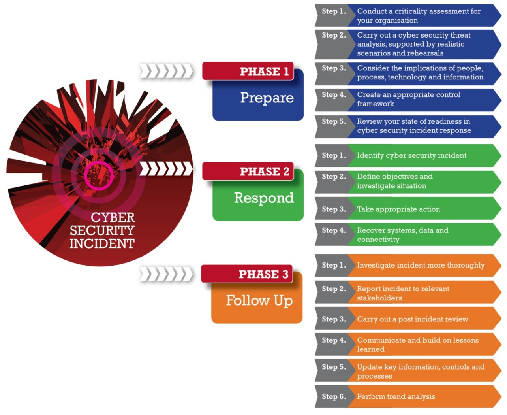
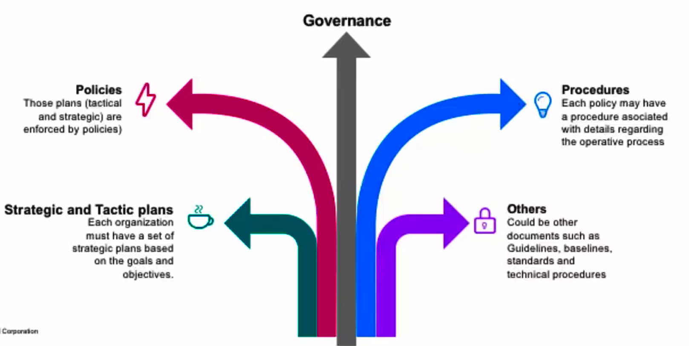

# CIA Triad

## CIA Triad - Confidentiality

  "To prevent any disclosure of data without prior authorization by the owner."

- We can force Confidentiality with encryption
- Elements such as authentication, access controls, physical security and permissions are normally used to enforce Confidentiality.

## CIA Triad - Integrity

- Normally implemented to verify and validate if the information that we sent or received has not been modified by an unauthorized person of the system.
- We can implement technical controls such as algorithms or hashes (MD5, SHA1, etc.)

## CIA Triad - Availability

- The basic principle of this term is to be sure that the information and data is always available when needed.
- Technical Implementations
  + RAIDs
  + Clusters (Different set of servers working as one)
  + ISP Redundancy
  + Back-Ups

## Non-Repudiation - How does it apply to CIA?

  "Valid proof of the identity of the data sender or receiver"

- Technical Implementations:
  + Digital signatures
  + Logs

# Access Management

- Access criteria
  + Groups
  + Time frame and specific dates
  + Physical location
  + Transaction type

- "Needed to Know" Just access information needed for the role
- Single Sign-on (SSO)

# Incident Response

## Incident Response

  "Computer security incident management involves the monitoring and detection of security events on a computer or a computer network and the execution of proper resources to those events. Means the information security or the incident management team will regularly check and monitor the security events occurring on a computer or in our network."

### Incident Management

- Events
- Incident
- Response team: Computer Security Incident Response Team (CSIRT)
- Investigation

## Key Concepts - Incident Response

### E-Discovery

  Data inventory, helps to understand the current tech status, data classification, data management, we could use automated systems. Understand how you control data retention and backup.

### Automated Systems

  Using SIEM, SOA, UBA, Big data analysis, honeypots/honey-tokens. Artificial Intelligence or other technologies we could enhance the mechanism to detect and control incidents that could compromise the tech environment.

### BCP (Business Continuity Plan) & Disaster Recovery

  Understand the company in order to prepare the BCP. A BIA it's good to have a clear understanding of the critical business areas. Also indicate if a security incident will trigger the BCP or the Disaster Recovery.

### Post Incident

  Root-Cause analysis, understand the difference between error, problem and isolated incident. Lessons learned and reports are a key.

## Incident Response Process

+ Prepare
+ Respond
+ Follow up

# Frameworks and their Purpose

## Introduction to Frameworks and Best Practices

### Best Practices, baseline and frameworks

- Used to improve the controls, methodologies and governance for the IT departments or the global behavior of the organization.
- Seeks to improve performance, controls and metrics.
- Helps to translate the business needs into technical or operational needs.

### Normative and compliance

- Rules to follow for a specific industry.
- Enforcement for the government, industry or clients.
- Event if the company or the organization do not want to implement those controls, for compliance.

### Best practices, frameworks and others

- COBIT
- ITIL
- ISOs
- COSO
- Project manager methodologies
- Industry best practices
- Developer recommendations
- others

## IT Governance Process

### Security Policies, procedures and other

+ Strategic and Tactic plans
+ Procedures
+ Policies
+ Governance
+ Others

 

## Cybersecurity Compliance and Audit Overview

  Compliance;

+ SOX
+ HIPPA
+ GLBA
+ PCI/DSS

- Audit
  + Define audit scope and limitations
  + Look for information, gathering information
  + Do the audit (different methods)
  + Feedback based on the findings
  + Deliver a report
  + Discuss the results

## Pentest Process and Mile 2 CPTE Training

### Pentest - Ethical Hacking

  A method of evaluating computer and network security by simulating an attack on a computer system or network form external and internal threats.
