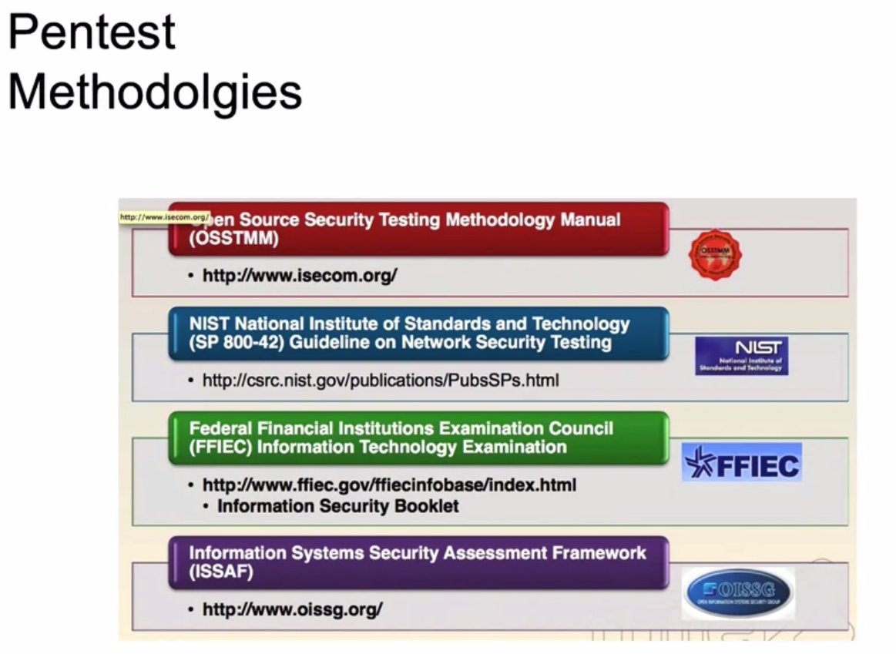
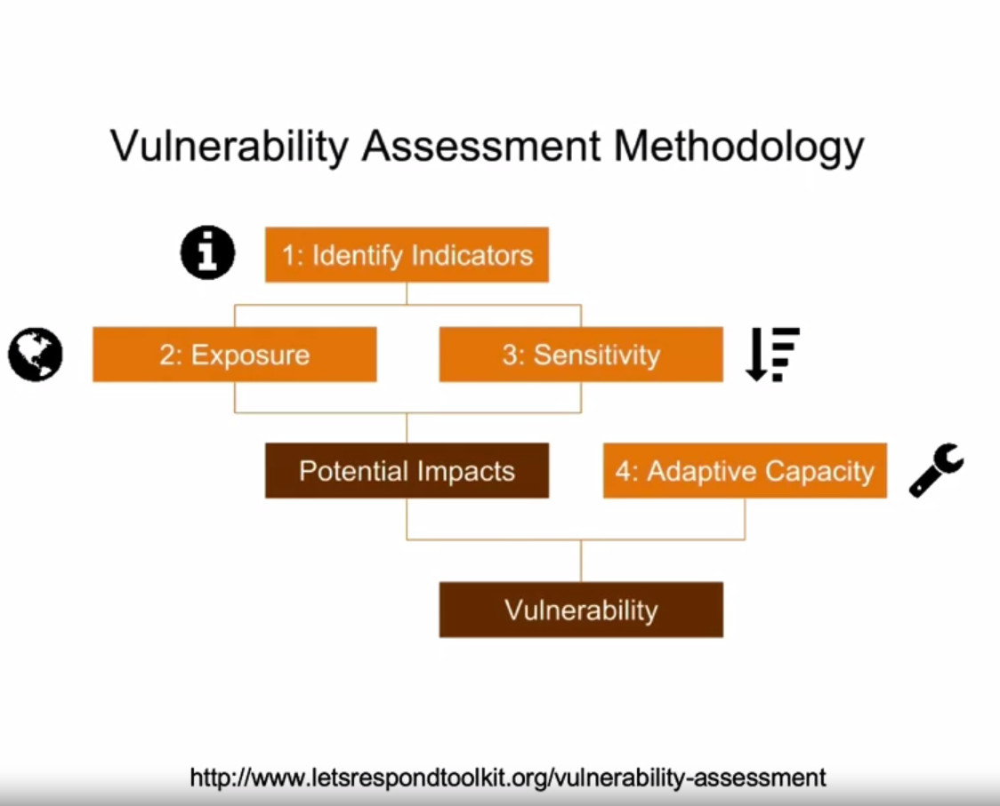

<!-- START doctoc generated TOC please keep comment here to allow auto update -->
<!-- DON'T EDIT THIS SECTION, INSTEAD RE-RUN doctoc TO UPDATE -->
**Table of Contents**

- [Firewalls](#firewalls)
  - [Introduction to Firewalls](#introduction-to-firewalls)
    - [Firewalls](#firewalls-1)
    - [Firewalls - Why?](#firewalls---why)
  - [Firewalls - Packet Filtering](#firewalls---packet-filtering)
  - [Firewalls - Application Gateway](#firewalls---application-gateway)
    - [Limitations of firewalls and gateways](#limitations-of-firewalls-and-gateways)
  - [Firewalls - XML Gateway](#firewalls---xml-gateway)
  - [Firewalls - Stateless and Stateful](#firewalls---stateless-and-stateful)
    - [Stateless Firewalls](#stateless-firewalls)
    - [Stateful Firewalls](#stateful-firewalls)
    - [Proxy Firewalls](#proxy-firewalls)
- [Antivirus/Anti-malware](#antivirusanti-malware)
- [Introduction to Cryptography](#introduction-to-cryptography)
  - [An Introduction of Cryptography](#an-introduction-of-cryptography)
    - [Cryptography - Key Concepts](#cryptography---key-concepts)
    - [Cryptographic Strength](#cryptographic-strength)
    - [Types of Cipher](#types-of-cipher)
  - [Types of Cryptography](#types-of-cryptography)
    - [Symmetric Encryption](#symmetric-encryption)
    - [Asymmetric Encryption](#asymmetric-encryption)
    - [Hash Functions](#hash-functions)
    - [Cryptographic Attacks](#cryptographic-attacks)
    - [DES: Data Encryption Standard](#des-data-encryption-standard)
    - [AES: Advanced Encryption Standard](#aes-advanced-encryption-standard)
- [First look at Penetration Testing and Digital Forensics](#first-look-at-penetration-testing-and-digital-forensics)
  - [Penetration Testing - Introduction](#penetration-testing---introduction)
    - [Hackers](#hackers)
    - [Threat Actors](#threat-actors)
  - [Pen-test Methodologies](#pen-test-methodologies)
  - [Vulnerability Tests](#vulnerability-tests)
  - [What is Digital Forensics?](#what-is-digital-forensics)
    - [Locard's Exchange Principle](#locards-exchange-principle)
    - [Chain of Custody](#chain-of-custody)
    - [Tools](#tools)

<!-- END doctoc generated TOC please keep comment here to allow auto update -->

# Firewalls

## Introduction to Firewalls

### Firewalls

  "Isolates organization's internal net from larger Internet, allowing some packets to pass, while blocking the others."

### Firewalls - Why?

- Prevent denial of service attacks;
  + SYN flooding: attacker establishes many bogus TCP connections, no resources left for "real" connections.
- Prevent illegal modification/access of internal data.
  + e.g. attacker replaces CIA's homepage with something else.
- Allow only authorized access to inside network (set of authenticated users/hosts)

- Two types of Firewalls
  + Application level
  + Packet filtering

## Firewalls - Packet Filtering

- Internal network connected to internet via router firewall
- router filters packet-by-packet, decision to forward/drop packet based on;
  + source IP address, destination IP address
  + TCP/UDP source and destination port numbers
  + ICMP message type
  + TCP SYNC and ACK bits

## Firewalls - Application Gateway

- Filters packets on application data as well as on IP/TCP/UDP fields.
  + Allow select internal users to telnet outside
    + Require all telnet users to telnet through gateway.
    + For authorized users, gateway sets up telnet connection to destination host. Gateway relays data between 2 connections.
    + Router filter blocks all telnet connections not originating from gateway.

### Limitations of firewalls and gateways

- IP spoofing: router can't know if data "really" comes from claimed source.
- If multiple app's need special treatment, each has own app gateway.
- Client software must know how to contact gateway.
  + e.g. must set IP address of proxy in Web Browser.
- Filters often use all or nothing for UDP.
- Trade-off: Degree of communication with outside world, level of security
- Many highly protected sites still suffer from attacks.

## Firewalls - XML Gateway

- XML traffic passes through a conventional firewall without inspection;
  + All across normal 'web' ports
- An XML gateway examines the payload of the XML message;
  + Well formed (meaning to specific) payload
  + No executable code
  + Target IP address makes sense
  + Source IP is known

## Firewalls - Stateless and Stateful

### Stateless Firewalls

- No concept of "state".
- Also called Packet Filter.
- Filter packets based on layer 3 and layer 4 information (IP and port).
- Lack of state makes it less secure.

### Stateful Firewalls

- Have state tables that allow the firewall to compare current packets with previous packets.
- Could be slower than packet filters but far more secure.
- Application Firewalls can make decisions based on Layer 7 information.

### Proxy Firewalls

- Acts as an intermediary server.
- Proxies terminate connections and initiate new ones, like a MITM.
- There are two 3-way handshakes between two devices.

# Antivirus/Anti-malware

- Specialized software that can detect, prevent and even destroy a computer virus or malware.
- Uses malware definitions.
- Scans the system and search for matches against the malware definitions.
- These definitions get constantly updated by vendors.

# Introduction to Cryptography

## An Introduction of Cryptography

- Cryptography is secret writing.
- Secure communication that may be understood by the intended recipient only.
- There is data in motion and data at rest. Both need to be secured.
- Not new, it has been used for thousands of years.
- Egyptians hieroglyphics, Spartan Scytale, Caesar Cipher, are examples of ancient Cryptography.

### Cryptography - Key Concepts

- Confidentiality
- Integrity
- Authentication
- Non-repudiation
- Crypto-analysis
- Cipher
- Plaintext
- Ciphertext
- Encryption
- Decryption

### Cryptographic Strength

- Relies on math, not secrecy.
- Ciphers that have stood the test of time are public algorithms.
- Mono-alphabetic < Poly-alphabetic Ciphers
- Modern ciphers use Modular math
- Exclusive OR(XOR) is the "secret sauce" behind modern encryption.

### Types of Cipher

- Stream Cipher: Encrypt or decrypt, a bit per bit.

- Block Cipher: Encrypt or decrypt in blocks or several sizes, depending on the algorithms.

## Types of Cryptography

  Three main types;
- Symmetric Encryption
- Asymmetric Encryption
- Hash

### Symmetric Encryption

- Use the same key to encrypt and decrypt.
- Security depends on keeping the key secret at all times.
- Strengths include speed and Cryptographic strength per bit of key.
- The bigger the key the stronger the algorithm.
- Key need to be shared using a secure, out-of-band method.
- DES, Triples DES, AES are examples of Symmetric Encryption.

### Asymmetric Encryption

- Whitefield Diffie and Martin Hellman, who created the Diffle-Hellman. Pioneers of Asymmetric Encryption.
- Uses two keys.
- One key ban be made public, called public key. The other one needs to be kept private called Private Key.
- One for encryption and one for decryption.
- Used in digital certificates.
- Public Key Infrastructure - PKI
- It uses "one-way" algorithms to generate the two keys. Like factoring prime numbers and discrete logarithm.
- Slower than Symmetric Encryption.

### Hash Functions

- A hash function provides encryption using an algorithm and no key.
- A variable-length plaintext is "hashed" into a fixed-length hash value, often called a "message digest" or simply a "hash".
- If the hash of a plaintext changes, the plaintext itself has changed.
- This provides integrity verification.
- SHA-1, MD5, older algorithms prone to collisions.
- SHA-2 is the newer and recommended alternative.

### Cryptographic Attacks

- Brute force
- Rainbow tables
- Social Engineering
- Known Plaintext
- Known ciphertext

### DES: Data Encryption Standard

- US encryption Standard [NIST 1993]
- 56-bit Symmetric key, 64-bit plaintext input 
- How secure is DES?
  + DES Challenge: 56-bit-key-encrypted phrase ("Strong Cryptography makes the world a safer place") decrypted (brute-force) in 4 months
  + No known "back-doors" decryption approach.
- Making DES more secure
  + Use three keys sequentially (3-DES) on each datum.
  + Use cipher-block chaining

### AES: Advanced Encryption Standard

- New (Nov. 2001) symmetric-key NIST standard, replacing DES.
- Processes data in 128-bit blocks.
- 128, 192, or 256-bit keys.
- Brute-force decryption (try each key) taking 1 sec on DES, takes 149 trillion years for AES.

# First look at Penetration Testing and Digital Forensics

## Penetration Testing - Introduction

- Also called Pentest, pen testing, ethical hacking.
- The practice of testing a computer system, network or application to find security vulnerabilities that an attacker could exploit.

### Hackers

- White Hat
- Grey Hat
- Black Hat

### Threat Actors

  "An entity that is partially or wholly responsible for an incident that affects or potentially affects an organization's security. Also referred to as malicious actor."

- There different types;
  + Script kiddies
  + Hacktivists
  + Organized Crime
  + Insiders
  + Competitors
  + Nation State
    > Fancy Bear (APT28)
    > Lazarous Group
    > Scarcruft (Group 123)
    > APT29

## Pen-test Methodologies

## Vulnerability Tests

 

## What is Digital Forensics?

- Branch of Forensics science.
- Includes the identification, recovery, investigation, validation, and presentation of facts regarding digital evidence found on the computers of similar digital storage media devices.

### Locard's Exchange Principle

DR. Edmond Locard;
  "A pioneer in Forensics science who became known as the Sherlock Holmes of France."

- The perpetrator of a crime will bring something into the crime scene and leave with something from it, and that both can be used as Forensic evidence.

### Chain of Custody

- Refers to the chronological documentation or paper trail that records the sequence of custody, control, transfer, analysis, and disposition of physical or electronic evidence.
- It is often a process that has been required for evidence to be shown legally in court.

### Tools

- Hardware

  + Faraday cage
  + Forensic laptops and power supplies, tool sets, digital camera, case folder, blank forms, evidence collection and packaging supplies, empty hard drives, hardware write blockers.

- Software

  + Volatility
  + FTK [Paid]
  + EnCase [Paid]
  + dd
  + Autopsy (The Sleuth Kit)
  + Bulk Extractor, and many more.
