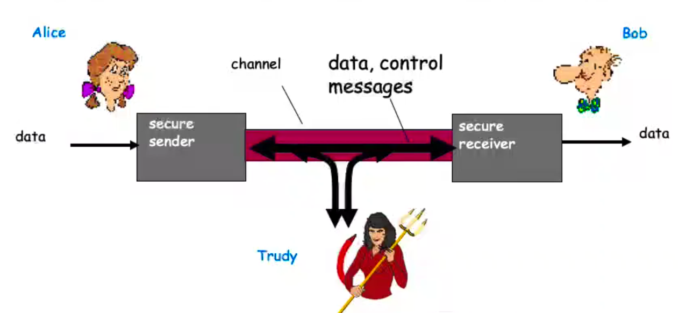

# Further discussion of confidentiality, integrity and availability

## Who are Alice, Bob and Trudy?

- Well known in network security world.
- Bob, Alice (friends) want to communicate "securely".
- Trudy (intruder) may intercept, delete, add messages.

 

## Confidentiality, Integrity and Availability

- Main components of network security.

### Confidentiality

- Preserving authorized restrictions on information access and disclosure, including means for protecting personal privacy and proprietary information.
- Loss of confidentiality is the unauthorized disclosure of information.

### Integrity

- Guarding against improper information modification or destruction.
- Including ensuring information non-repudiation and authenticity.
- Integrity loss is the unauthorized modification or destruction of information.

### Availability

- Timely and reliable access to information.
- Loss of availability is the disruption of access to an information system.

## Authenticity and Accountability

- Authenticity: property of being genuine and verifiable.
- Accountability: mapping actions to an identity.

